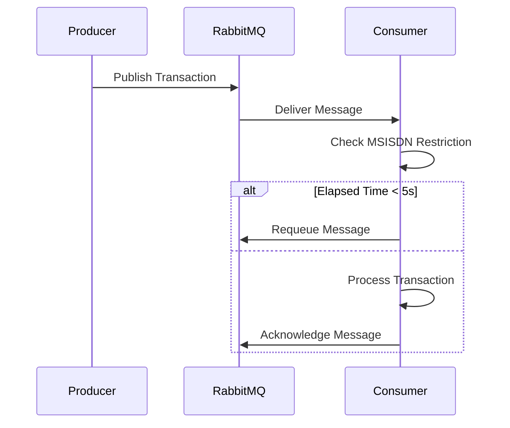

# Transaction Limit Service

The **Transaction Limit Service** is a message-driven architecture powered by RabbitMQ, enabling rate-limited and delayed processing of user transactions. This service ensures controlled processing of transactions while maintaining reliability, persistence, and fault tolerance.

---

## **Table of Contents**
1. [Overview](#overview)
2. [Architecture](#architecture)
3. [Features](#features)
4. [How It Works](#how-it-works)
5. [Setup](#setup)
6. [Example Usage](#example-usage)
7. [Components](#components)
8. [MSISDN Restriction](#msisdn-restriction)
9. [Diagrams](#diagrams)
10. [Future Enhancements](#future-enhancements)

---

## **Overview**
This service is built to handle transactions while respecting rate limits and ensuring no concurrent processing of the same user's transactions within a given delay period. It uses RabbitMQ for message queuing, persistence, and reliability.

---

## **Architecture**
The architecture consists of the following components:

1. **Producer**:
    - Publishes transaction messages to a RabbitMQ exchange.
    - Messages are routed to a specific queue based on the routing key.

2. **Consumer**:
    - Consumes messages from the queue at a defined rate.
    - Applies rate limiting (e.g., 10 transactions per second).
    - Enforces a 5-second delay restriction for processing transactions with the same MSISDN (user's phone number).

3. **RabbitMQ**:
    - Handles message durability and delivery.
    - Uses a direct exchange to route messages to the correct queue.
    - Supports dead-lettering of expired or failed messages.

---

## **Features**
- **Rate Limiting**: Limits the number of transactions processed per second using Guava's `RateLimiter`.
- **MSISDN Restriction**: Ensures no transaction for the same MSISDN is processed within 5 seconds of the previous one.
- **Message Persistence**: Messages persist across RabbitMQ server restarts using Docker volumes.
- **Dead-Letter Queue**: Supports routing expired or failed messages to a dead-letter queue for further inspection.
- **Manual Acknowledgment**: Ensures messages are only removed from the queue after successful processing.

---

## **How It Works**
1. **Message Production**:
    - A producer publishes a transaction message to RabbitMQ.
    - The message is routed to the `transaction-limit-queue`.

2. **Message Consumption**:
    - The consumer retrieves messages from the queue at a controlled rate.
    - It checks if the transaction can be processed (based on MSISDN restriction logic).
    - If valid, the transaction is processed and acknowledged.
    - If not, the message is requeued or rejected.

3. **Dead-Letter Queue** (Optional):
    - Expired or rejected messages are routed to a dead-letter queue for inspection.

---

## **Setup**
### Prerequisites
- **Docker**: Ensure Docker is installed on your system.
- **RabbitMQ**: The service uses RabbitMQ with the management plugin enabled.

### Steps
1. Clone the repository:
   ```bash
   git clone https://github.com/sripiranavany/transaction-limit
   cd transaction-limit
   ```
2. Start RabbitMQ and Charging Simulator using Docker Compose:
   ```bash
   docker-compose up -d
   ```
3. Build and run the Spring Boot application:
   ```bash
   ./mvnw spring-boot:run
   ```

---

## **Example Usage**
### Publish a Transaction
Use `curl` to publish a transaction to RabbitMQ:
```bash
curl -X POST \
  -H "Content-Type: application/json" \
  -d '{
        "appId": "APP_001",
        "appName": "testApp",
        "cost": "4.5",
        "currency": "LKR",
        "msisdn": "94778585968"
      }' \
  http://localhost:8080/api/transactions
```

### Check RabbitMQ
- Access the RabbitMQ Management Console at [http://localhost:15672](http://localhost:15672).
- Default credentials: `guest` / `guest`.

---

## **Components**

### **Producer**
The producer sends messages to RabbitMQ:
- **Exchange**: `transaction-limit-exchange`
- **Routing Key**: `transaction-limit-routing-key`
- **Message Format**: JSON (e.g., `Transaction` object)

### **Consumer**
The consumer processes messages:
- Limits throughput using a rate limiter.
- Enforces a 5-second delay restriction for transactions with the same MSISDN.
- Acknowledges messages post successful processing.

### **RabbitMQ Queues**
1. **Transaction Queue**:
    - Durable queue for storing transaction messages.
2. **Dead-Letter Queue** (Optional):
    - Stores expired or rejected messages.

---

## **MSISDN Restriction**
The MSISDN restriction ensures that no two transactions with the same MSISDN (user’s phone number) are processed within a 5-second window. This is achieved using an in-memory cache.

### Implementation Details
1. **Cache**:
    - A thread-safe `ConcurrentHashMap` or similar structure is used to store the last processed timestamp for each MSISDN.
2. **Logic**:
    - On consuming a message:
        - If the time elapsed since the last processed transaction for the MSISDN is less than 5 seconds, the message is requeued.
        - Otherwise, the transaction is processed and the timestamp is updated.

---

## **Diagrams**

### **System Architecture**
```mermaid
flowchart LR
    subgraph Producer
        A[Transaction Sender]
        A --> B[Publish to Exchange]
    end
    subgraph RabbitMQ
        B --> C[Direct Exchange]
        C --> D[Transaction Queue]
        D --> E[Dead-Letter Queue (Optional)]
    end
    subgraph Consumer
        D --> F[Rate-Limited Consumer]
        F --> G[Check MSISDN Restriction]
        G --> H{Elapsed Time >= 5s?}
        H -- Yes --> I[Process Transaction]
        H -- No --> J[Requeue Message]
        I --> K[Manual Ack]
    end
```

### **Message Flow**


---

## **Future Enhancements**
1. **High Availability**:
    - Configure RabbitMQ to run in a clustered mode for fault tolerance.
2. **Monitoring**:
    - Add Prometheus metrics for monitoring queue depth and processing rates.
3. **Retry Mechanism**:
    - Implement a retry mechanism for failed transactions before routing them to the dead-letter queue.

---

## **Contributing**
Contributions are welcome! Please submit a pull request or open an issue for suggestions and bug reports.

---

## **License**
This project is licensed under the MIT License.
